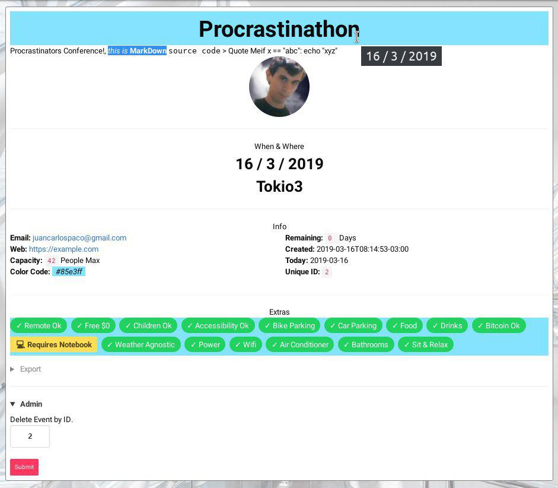
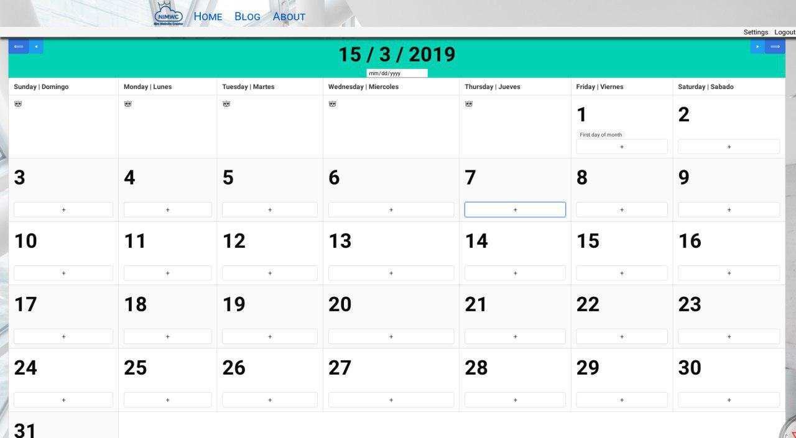

# nimwc-calendar

- Calendar for Events for [NimWC](https://nimwc.org/login), designed for human social interaction events (Hackathons, Meetups, Conferences, etc).

URL is `/calendar/ISO-DATE-HERE`, using ISO Format standard, example `/calendar/2019-12-01`.

Time of day agnostic, but you can use the Description on ReSTructuredText to write the Hour.

Everyone can see the Calendar and Events. Admin can Delete Events. 

Click on "+" button to add an Event. Title of Event with Link to Event replaces the "+" if theres an Even that day.

Is designed on a spoken language agnostic way, but English/Spanish are supported.

Material Design and Dark theme is supported.

Has a Date Picker to jump from date to date.

Basic Event CSV export.

Full page full width, but works ok on mobile.
